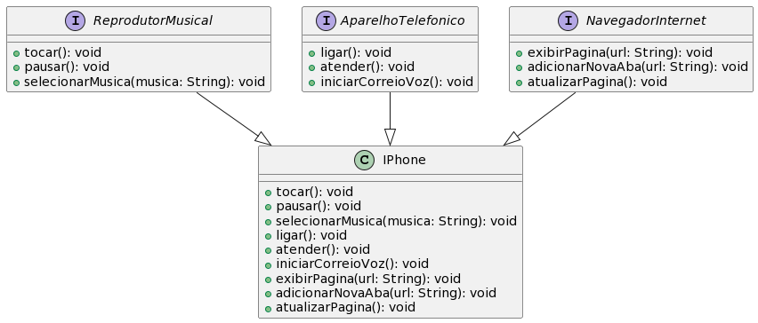

# Diagrama UML do iPhone

Este documento apresenta um diagrama UML que representa as estruturas de classes e interfaces para modelagem de um iPhone. O projeto foi desenvolvido durante o Santander Bootcamp 2023 na DIO.me e incorpora implementações e funcionalidades para cada comportamento esperado no contexto do desafio.

## Contexto do Projeto

O diagrama UML a seguir foi criado como parte do projeto do Santander Bootcamp 2023 na plataforma DIO.me. Ele representa a arquitetura do iPhone, incluindo interfaces, classes e seus relacionamentos, para atender aos requisitos do desafio proposto.

## Estrutura do Diagrama UML

O diagrama inclui as seguintes estruturas: 

# Interfaces e Classes do iPhone

Este documento descreve as interfaces e classes do iPhone, bem como suas funcionalidades e relacionamentos.

## Interfaces

### 1. Interface `ReprodutorMusical`

A interface `ReprodutorMusical` representa as funcionalidades relacionadas à reprodução de música.

**Funcionalidades:**
- `tocar(): void`: Inicia a reprodução da música.
- `pausar(): void`: Pausa a reprodução da música.
- `selecionarMusica(musica: String): void`: Seleciona uma música para reprodução.

### 2. Interface `AparelhoTelefonico`

A interface `AparelhoTelefonico` representa as funcionalidades relacionadas ao uso do iPhone como um aparelho telefônico.

**Funcionalidades:**
- `ligar(): void`: Liga o telefone.
- `atender(): void`: Atende uma chamada recebida.
- `iniciarCorreioVoz(): void`: Inicia o correio de voz.

### 3. Interface `NavegadorInternet`

A interface `NavegadorInternet` representa as funcionalidades relacionadas à navegação na internet.

**Funcionalidades:**
- `exibirPagina(url: String): void`: Exibe uma página da web específica.
- `adicionarNovaAba(url: String): void`: Adiciona uma nova aba de navegação com a página especificada.
- `atualizarPagina(): void`: Atualiza a página web atual.

## Classe

### Classe `IPhone`

A classe `IPhone` implementa as interfaces `ReprodutorMusical`, `AparelhoTelefonico` e `NavegadorInternet`, representando um iPhone com todas as funcionalidades integradas.

**Funcionalidades (Métodos Implementados):**
- Métodos da Interface `ReprodutorMusical`
    - `tocar(): void`
    - `pausar(): void`
    - `selecionarMusica(musica: String): void`
- Métodos da Interface `AparelhoTelefonico`
    - `ligar(): void`
    - `atender(): void`
    - `iniciarCorreioVoz(): void`
- Métodos da Interface `NavegadorInternet`
    - `exibirPagina(url: String): void`
    - `adicionarNovaAba(url: String): void`
    - `atualizarPagina(): void`

**Relacionamentos:**
- `IPhone` implementa `ReprodutorMusical`, `AparelhoTelefonico` e `NavegadorInternet`.
